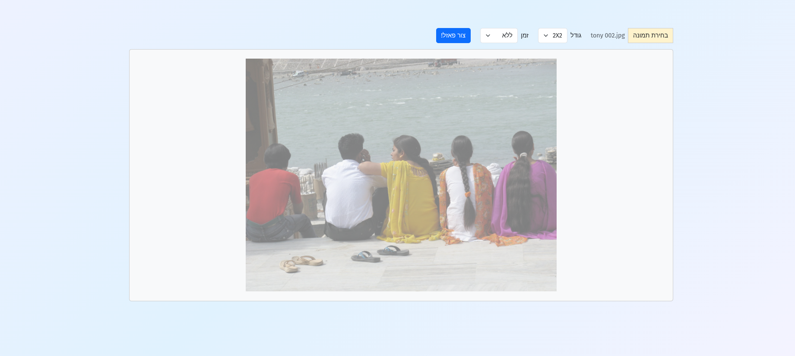
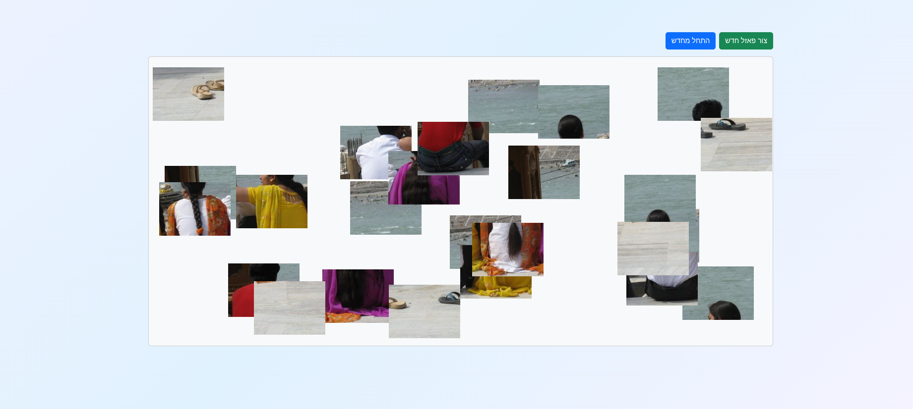
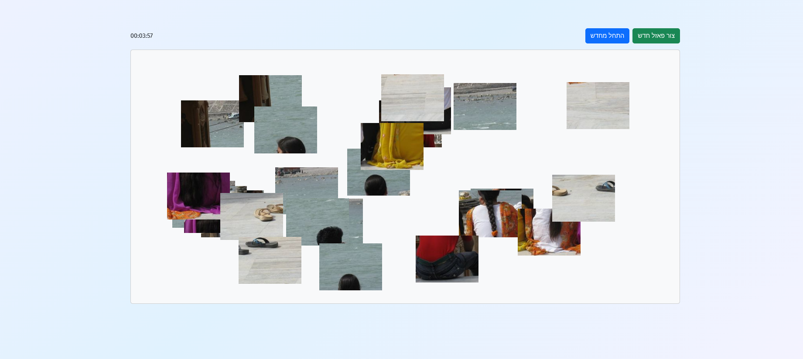
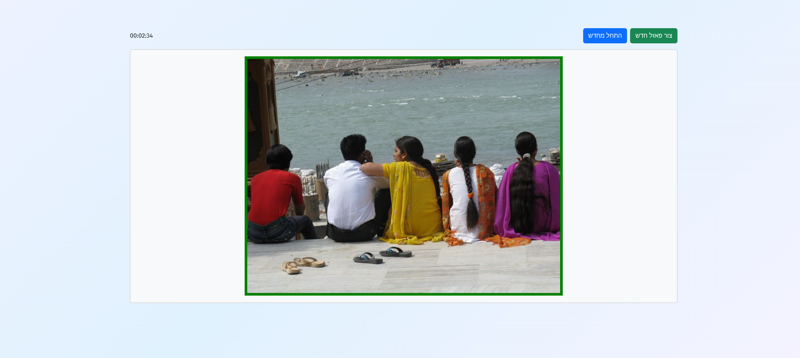

# Puzzle

## Screenshots

|  |  |
|---|---|
|  |  |
|  |  |

A browser jigsaw puzzle game that I built for my kids, with a Hebrew UI. Upload any image, pick a grid size, and the
server slices it into pieces that you drag together in the browser. Pieces snap to their
correct neighbours on release and merge into groups that then drag as one. Optionally play
against a countdown.

## Stack

| Part | Tech |
| --- | --- |
| Client | React 19, TypeScript, Vite, React Router, React Bootstrap |
| Server | Node 22, Express 5, multer (in-memory uploads), sharp (image slicing) |
| Delivery | Docker Compose — nginx serves the built client and reverse-proxies `/api` |

## How a request flows

The frontend never calls the API by absolute URL. `App.tsx` posts to the relative path
`/api/puzzleme`, which the browser resolves against whatever origin served the page. What
forwards that path to the API differs per environment:

- **Production (Docker):** browser → nginx on `localhost:5173` → `server:3001` inside the
  compose network. The rule lives in `client/nginx.conf`.
- **Development:** browser → Vite dev server on `localhost:5173` → `localhost:5177`. The rule
  lives in `client/vite.config.ts`.

## Layout

```
.
├── .env                  # shared config, read by both sides (see below)
├── docker-compose.yml
├── client/
│   ├── dockerfile        # multi-stage: vite build → nginx:alpine
│   ├── nginx.conf        # SPA fallback + /api proxy + upload size limit
│   └── src/
│       ├── App.tsx       # the whole game: upload, drag, snap, solve detection
│       ├── main.tsx      # router setup
│       └── components/Layout.tsx
└── server/
    ├── dockerfile
    ├── index.js          # express app + multer config
    └── controllers/puzzlemeContoller.js   # sharp slicing logic
```

## Configuration

A single `.env` at the repo root feeds both sides. The client reads it because
`vite.config.ts` sets `envDir: '..'`; the server reads it via `dotenv` pointed at `../.env`.

| Variable | Used by | Purpose |
| --- | --- | --- |
| `SERVER_PORT` | server | Port Express listens on. `5177` locally; Compose overrides it to `3001`. |
| `VITE_MAX_IMAGE_HEIGHT` | client, server | Uploads taller than this are downscaled before slicing. Also sets the preview height. |
| `DOMAIN` | — | Declared but not currently read by any code. |

`VITE_MAX_IMAGE_HEIGHT` is baked into the client bundle at build time, not read at runtime.
Because the Compose build context is `./client`, the root `.env` is outside it, so the value
is passed through explicitly as a build arg in `docker-compose.yml`.

## Running with Docker

```bash
docker compose up -d --build
```

- Client: <http://localhost:5173>
- API: <http://localhost:3001>

Use `--build` whenever you change `client/nginx.conf`, any client source, or
`VITE_MAX_IMAGE_HEIGHT`. All three are baked into the image at build time — a plain
`docker compose up -d` will silently reuse the old image and serve stale config.

Logs and a quick upstream health check:

```bash
docker compose logs -f server
docker compose exec client wget -qO- http://server:3001/api/test
```

## Running locally

Two terminals, both needed — the client alone will fail every upload.

```bash
cd server && npm install && npm run dev     # nodemon on $SERVER_PORT (5177)
cd client && npm install && npm run dev     # vite on 5173
```

Then open <http://localhost:5173>.

Note that the dev server and the Compose client both want port 5173, so run one or the other,
not both.

Other client scripts: `npm run build` (typecheck via `tsc -b`, then bundle), `npm run lint`,
`npm run preview`.

## API

### `POST /api/puzzleme`

`multipart/form-data`:

| Field | Type | Description |
| --- | --- | --- |
| `file` | file | Source image. Max 7 MB (multer); nginx allows 8 MB bodies. |
| `piecesNum` | number | Grid size N. The image is cut into an N×N grid, so N=4 yields 16 pieces. |

Responds with every piece as a base64 PNG data URL plus the full solved image:

```json
{
  "pieces": [
    {
      "counter": 1,
      "row": 0,
      "col": 0,
      "currentWidth": 150,
      "currentHeight": 150,
      "image": "data:image/png;base64,..."
    }
  ],
  "imageBuffer": "<base64 of the whole resized image>"
}
```

`counter` is the 1-based position in reading order and is what the client uses to decide
which pieces are neighbours. Edge pieces absorb the remainder of the integer division, so
they can be a few pixels larger than the rest.

Errors: `400` for a missing file, an invalid `piecesNum`, or undetectable dimensions; `500`
if sharp fails.

### `GET /api/test`

Health check. Returns `{"message":"Node server is working"}`.

## Gameplay mechanics

Each piece starts at a random position and carries a `groupId`, initially its own `counter`.

- **Dragging** moves every piece sharing the dragged piece's `groupId`. The delta is clamped
  against the group's bounding box so no member can leave the board.
- **Snapping** is evaluated only on pointer release. Two pieces are candidate neighbours when
  their `counter` values differ by 1 (same row) or by N (same column). If the relevant edges
  land within `SNAP_EPS` (20px) and the pieces overlap on the perpendicular axis, the group
  jumps flush against the neighbour and the two groups merge into one `groupId`.
- **Solved** is checked on every `pieces` change: each piece must sit exactly flush after the
  previous one in `counter` order. On success the countdown pauses and the assembled image
  replaces the individual pieces.
- **Countdown** is optional (off, or 1–5 minutes). Running out before solving ends the game
  and freezes dragging.

Board dimensions are fixed constants at the top of `App.tsx` (`CONTAINER_WIDTH` 1400,
`CONTAINER_HEIGHT` 650), which is why very large images are downscaled server-side first.

## Known rough edges

- `puzzlemeContoller.js` reads `VITE_MAX_IMAGE_HEIGHT`, but `docker-compose.yml` only passes
  that variable to the *client* build. Under Compose the server sees `undefined`, so the
  downscale step is skipped and tall images are sliced at full size.
- `server/` has no `.dockerignore`, so `COPY . .` copies the host `node_modules` over the
  result of `npm ci --omit=dev`. It works today because the host tree happens to carry both
  glibc and musl `sharp` binaries, but it is not portable across machines.
- The controller still logs piece dimensions to stdout on every request.
